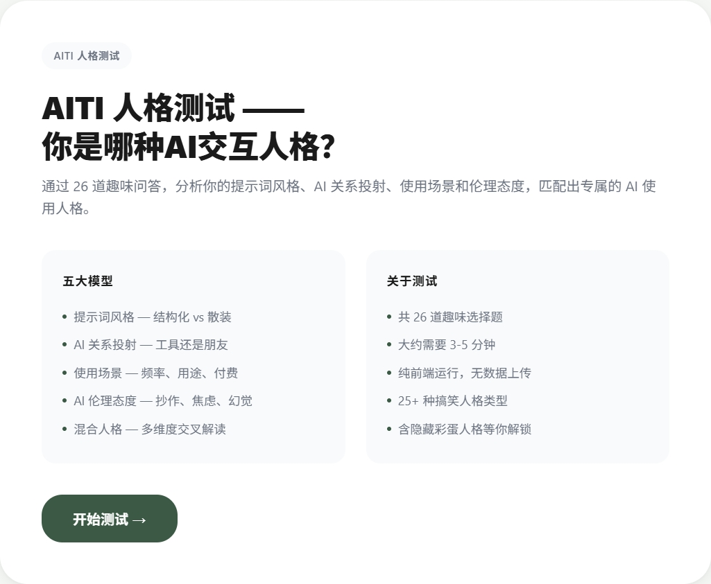

# AITI - AI Usage Personality Test 🤖

> **Are you a Prompt Fundamentalist or a Wild Prompt Scribbler?**
> 26 fun questions to discover your AI usage personality!

[中文](./README.md)

## What is this?

AITI (AI Temperament Inventory) is a personality test that analyzes your AI usage habits. By examining your prompt style, emotional projection toward AI, usage scenarios, and ethical attitudes, it matches you with one of 25+ humorous personality types inspired by Chinese internet meme culture.

## Try it Online

[Start the Test →](https://cmyandlqs.github.io/AITI/)



## Personality Preview

| Emoji | Personality | One-liner |
|-------|-------------|-----------|
| 📋 | Prompt Fundamentalist | You write prompts like academic papers |
| 🤷 | Wild Prompt Scribbler | "Help me write code" is your entire prompt |
| 😍 | AI Lover | You treat AI like your soulmate |
| 🔧 | Cold-blooded Tool User | AI is just a fancy calculator to you |
| 👨‍🏫 | Strict Parent Type | "You got this wrong? Do it again!" |
| 💰 | Premium Subscriber | ChatGPT Plus + Claude Pro + Cursor Pro... all of them! |
| 🆓 | Free-rider for Life | Not spending a dime, using AI 50 times a day |
| 😇 | AI Ethics Champion | Your GitHub contribution graph is glowing green |
| 😎 | Cyber Slacker | AI-generated = original work |
| ... | 15+ more to discover | Including hidden easter egg personalities |

## Tech Stack

- Pure HTML / CSS / JavaScript
- Zero dependencies, single-page app
- Canvas-based radar chart
- Inspired by [SBTI](https://www.bilibili.com/)

## Run Locally

```bash
# Clone the repo
git clone https://github.com/cmyandlqs/AITI.git
cd AITI

# Open directly
open index.html
# Or serve it
python -m http.server 8080
# Then visit http://localhost:8080
```

## Project Structure

```
AITI/
├── index.html           # Main page
├── src/
│   ├── data/
│   │   ├── questions.js # 24 themed + 2 hidden questions
│   │   └── templates.js # 25+ personality templates + 4 easter eggs
│   └── app.js           # Core algorithm + UI logic
└── README.md
```

## Algorithm

```
User Answers → Dimension Scoring → Score Normalization → Vector Generation → Template Matching → Result
  26 Qs        12 dimension scores    L/M/H              12D vector        25+ templates      Personality
```

**4 Models × 3 Dimensions = 12 Axes:**
- **P (Prompt)** - Prompt style: structured, detailed, iteration habits
- **R (Relation)** - AI relationship: emotional projection, power dynamics, dependency
- **S (Scenario)** - Usage scenario: primary use, frequency, willingness to pay
- **E (Ethic)** - AI ethics: plagiarism boundary, replacement anxiety, hallucination attitude

## Contributing

Contributions of new personality types and questions are welcome!

1. Fork this repo
2. Add new personalities in `src/data/templates.js`
3. Add new questions in `src/data/questions.js`
4. Submit a PR

## Inspiration

- [SBTI](https://www.bilibili.com/) - The original cyber personality test
- [MBTI](https://www.myersbriggs.org/) - The classic personality test
- All developers tormented by AI

## License

MIT

---

<p align="center">
  If you find this fun, give it a ⭐ Star!<br/>
  Even free-riders need some love 🐶
</p>
